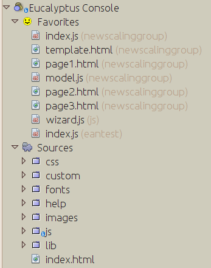

Ad Hoc Project NetBeans Plugin
==============================

A NetBeans Plugin to make any folder a project.

NetBeans is project-oriented; yet if you do web or similar development, sometimes it can be useful to work with a folder *as if* it were a project, even though it isn't in terms of having a build file or similar.

This plugin lets you make any folder into a project.  It is no-frills, and tries to simply do the Right Thing.  

Features
--------

Each project has a **Favorites** subnode that will show frequently opened files in the order of how often you use them; and a sources node which is just the vanilla file hierarchy.

The plugin does not write any metadata into project folders - it is all kept in your NetBeans settings directory - so there are no surprises with versioning checkins and such.

The project does allow you to set code formatting options on a per-project basis - so if you're working in a project that, say, wants a 2-space indent for Javascript and a 4-space indent for HTML, it will let you do that and remember the settings.  In fact, that specific scenario is the reason this plugin was written :-)

Installation
------------
Download the latest ``nbm`` file from [the continuous build server](https://timboudreau.com/builds/job/Netbeans-Adhoc-Project-Plugin/lastSuccessfulBuild/artifact/adhoc-project/target/).  Install it in the IDE by opening **Tools | Plugins**, on the **Downloaded** tab.

License
-------

MIT license - do what thou wilt, give credit where it's due.

